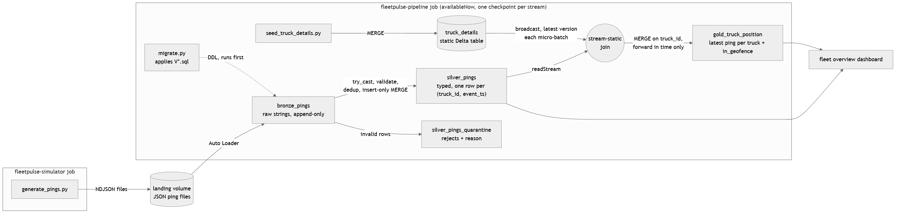

# fleetpulse

GPS pings from a truck fleet, streamed through bronze / silver / gold on Databricks and joined with
truck reference data. Everything (schema, volumes, tables, jobs, dashboard) is deployed by one bundle to
`dev`, `test` and `prod`.



The diagram is generated from [docs/architecture.mmd](docs/architecture.mmd) with mermaid-cli
(`mmdc -i docs/architecture.mmd -o docs/architecture.png -b white -s 2 -w 1400`).

Design notes and trade-offs are in [DESIGN.md](DESIGN.md). Proof that it runs is in [docs/](docs/).

## Layout

```
databricks.yml                     targets and variables
resources/
  unity_catalog.yml                schema + landing / checkpoints volumes
  fleetpulse_pipeline.job.yml      migrate -> seed_truck_details, bronze -> silver -> gold
  fleetpulse_simulator.job.yml     synthetic ping generator
  fleetpulse.dashboard.yml         fleet overview dashboard
src/
  migrations/V*.sql                versioned DDL, applied in order by migrate.py
  migrate.py
  seed_truck_details.py
  generate_pings.py
  bronze.py  silver.py  gold.py
  dashboards/fleet_overview.lvdash.json
.github/workflows/deploy-dev.yml   validate on PR, deploy dev on push to main
docs/                              data-flow diagram, CLI logs and screenshots from the runs
```

## Targets

|                   | dev                          | test                     | prod                       |
|-------------------|------------------------------|--------------------------|----------------------------|
| mode              | development                  | -                        | production                 |
| schema            | `telematics.dev_<user>_dev`  | `telematics.test`        | `telematics.prod`          |
| pipeline job      | `[dev <user>] fleetpulse-pipeline-dev` | `fleetpulse-pipeline-test` | `fleetpulse-pipeline-prod` |
| schedule          | paused                       | hourly                   | every 15 minutes           |

Schedules run on US Eastern time. Development mode prefixes names with the deploying user so people
don't collide in dev.
`databricks bundle summary -t <target>` prints the exact names.

## Prerequisites

- A Databricks workspace (Free Edition is fine). No compute is declared anywhere in the bundle, so
  every task runs on serverless.
- Databricks CLI, recent 1.x (developed against v1.19.0).
- Auth: `databricks configure` with the workspace URL and a personal access token, then
  `databricks current-user me` to check.

## One-time setup

The catalog is shared by all three targets, so no single target owns it. Create it once, from the
SQL editor:

```sql
CREATE CATALOG IF NOT EXISTS telematics;
```

On Free Edition this has to go through SQL (or Catalog Explorer): the metastore has no storage root,
so `databricks catalogs create` is rejected, while SQL picks up the account's default storage.

If your workspace doesn't let you create catalogs, use one you can write to and pass
`--var catalog=<name>` to every `deploy` and `run` below.

## Deploy and run

```
databricks bundle validate

databricks bundle deploy -t dev
databricks bundle run fleetpulse_simulator -t dev   # ~20 files of pings into the landing volume
databricks bundle run fleetpulse_pipeline  -t dev   # migrations, then bronze -> silver -> gold
```

Then the same for `test` and `prod`:

```
databricks bundle deploy -t test && databricks bundle run fleetpulse_simulator -t test && databricks bundle run fleetpulse_pipeline -t test
databricks bundle deploy -t prod && databricks bundle run fleetpulse_simulator -t prod && databricks bundle run fleetpulse_pipeline -t prod
```

More data: `databricks bundle run fleetpulse_simulator -t dev --params batches=50`.
On Free Edition I deploy `test` and `prod` with `--var pipeline_pause_status=PAUSED` between demos so
the schedules don't burn the daily compute quota; deploy without the flag to turn them back on.
Running the pipeline again only processes files that arrived since the last run.

## Checking the result

```sql
SELECT truck_id, driver, region, home_depot, make, model, event_ts, latitude, longitude, in_geofence
FROM telematics.prod.gold_truck_position
ORDER BY region, truck_id;

-- what was rejected and why
SELECT reason, count(*) FROM telematics.prod.silver_pings_quarantine GROUP BY reason;

-- schema version of an environment
SELECT * FROM telematics.prod._schema_migrations ORDER BY version;
```

## Dashboard

`fleetpulse fleet overview (<target>)` is deployed with the bundle to every target. Its queries use
unqualified table names and the bundle points them at the target's catalog and schema
(`dataset_catalog` / `dataset_schema`); the SQL warehouse is looked up by name. Times are shown in
US Eastern.

## Changing a table

Tables are never created or altered by hand, in any environment.

1. Add `src/migrations/V<next>__<what>.sql`. Never edit a migration that has already been
   applied anywhere; the runner checksums them and will fail the job if one changes.
2. Change the code that writes the table, in the same commit.
3. Deploy and run `dev`, then `test`, then `prod`. The `migrate` task runs first in every
   pipeline run, so the new column exists before any writer needs it.

`V002__gold_truck_position_add_in_geofence.sql` went through exactly this; the before/after for
`prod`, including `DESCRIBE HISTORY` showing the `ADD COLUMNS` done by the pipeline job, is in
[docs/evidence](docs/evidence/).

## CI

`.github/workflows/deploy-dev.yml` validates the bundle on every PR and deploys `dev` on push to
`main`. It needs two repository secrets: `DATABRICKS_HOST` and `DATABRICKS_TOKEN`.
