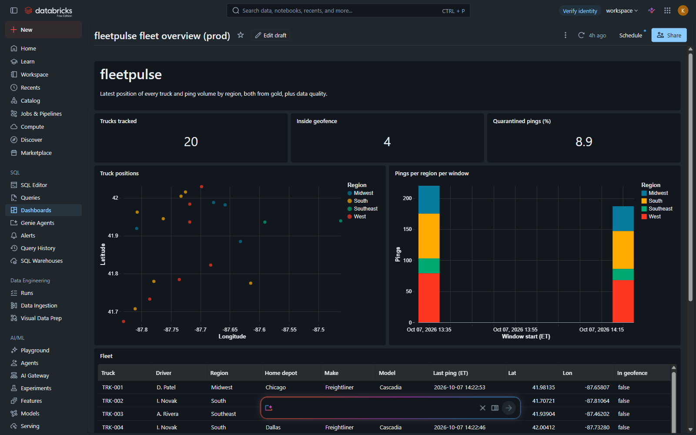

# Evidence

CLI output captured while building and promoting the bundle. Workspace host and user are redacted,
times are US Eastern.

| File | What it shows |
|------|---------------|
| [00-cli-version](evidence/00-cli-version.txt) | Databricks CLI used for every deploy |
| [01-dev-deploy](evidence/01-dev-deploy.txt) | first `validate` + `deploy` of dev: schema, volumes and jobs created |
| [02](evidence/02-dev-simulator.txt), [03](evidence/03-dev-pipeline.txt) | simulator and pipeline runs in dev |
| [04-dev-checks](evidence/04-dev-checks.txt) | 20 files, 250 bronze rows, 210 silver + 20 quarantined (the 20 planted duplicates dropped), 20 trucks in gold joined with `truck_details` |
| [05-dev-rerun-no-new-data](evidence/05-dev-rerun-no-new-data.txt) | pipeline rerun with nothing new: counts unchanged, silver history still has a single MERGE |
| [06-test-v001](evidence/06-test-v001.txt), [07-prod-v001](evidence/07-prod-v001.txt) | test and prod at V001: deploy, simulator, pipeline |
| [08](evidence/08-dev-v002-before.txt), [09](evidence/09-dev-v002-run.txt), [10](evidence/10-dev-v002-after.txt) | V002 in dev (code deployed by CI): before, run, after |
| [12-test-v002](evidence/12-test-v002.txt) | V002 in test |
| [11](evidence/11-prod-v002-before.txt), [13](evidence/13-prod-v002.txt), [15](evidence/15-prod-v002-after.txt) | V002 in prod: before (V1, 11 columns), deploy + run, after (V2, `in_geofence`, and `DESCRIBE HISTORY` with `ADD COLUMNS` / `UPDATE` done by the pipeline job) |
| [14-dev-stop-restart](evidence/14-dev-stop-restart.txt) | run cancelled during silver after bronze took 10 new files; the rerun resumes from the checkpoint with one MERGE of 89 rows, and bronze 594 = silver 494 + quarantine 50 + 50 planted duplicates |
| [16-test](evidence/16-test-dashboard-deploy.txt), [17-prod](evidence/17-prod-dashboard-deploy.txt) | dashboard deployed to test and prod |

## Screenshots

Taken from the workspace after the V002 promotion. The user is redacted, times are US Eastern.

| | |
|---|---|
| [01 jobs](screenshots/01-jobs.png) | all six jobs (pipeline and simulator for dev, test, prod), deployed by the bundle; test/prod schedules paused to save Free Edition quota |
| [02 prod pipeline](screenshots/02-prod-pipeline-tasks.png) | task graph, "Connected to Declarative Automation Bundles", every-15-minute schedule, job parameters |
| [03 prod runs](screenshots/03-prod-pipeline-runs.png) | run history of the prod pipeline |
| [04 prod run](screenshots/04-prod-run-v002.png) | the run that applied V002: migrate, then seed/bronze, silver, gold |
| [05 gold history](screenshots/05-prod-gold-history.png) | `ADD COLUMNS` and the backfill `UPDATE` on prod gold, written by that run |
| [06 migrations ledger](screenshots/06-prod-schema-migrations.png) | `_schema_migrations` in prod: V1 and V2 with checksums |
| [07 gold columns](screenshots/07-prod-gold-columns.png) | gold after V002, including `in_geofence` |
| [08 gold sample](screenshots/08-prod-gold-sample.png) | gold rows joined with `truck_details` |
| [09 dashboard](screenshots/09-prod-dashboard.png) | fleet overview dashboard in prod |
| [10 CI](screenshots/10-github-actions.png) | GitHub Actions runs (taken when CI deployed only dev; it now maps `dev`, `test`, `main` to dev, test, prod) |

